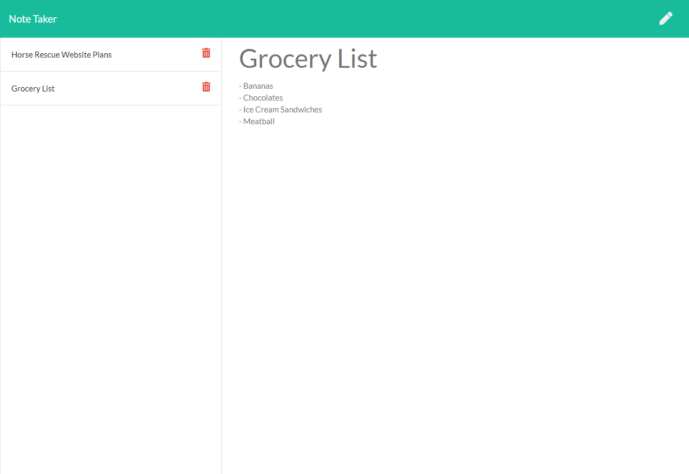

 # Note Taker Application
  
  
  ---

  ## **Description**
    
  The assignment was to create a Note Taker application using Express that the user can enter, save, and edit quick notes.  

  ---
  
  ## Table of Contents  
  
  - [Description](#Description)  
  - [Installation](#Installation)
  - [Usage](#Usage)
  - [Test Instructions](#Tests)
  - [Contributions](#Contributions)
  - [License](#License)
  - [Questions & Contact](#Questions)
  
  
  ---
  
  ## **Installation**
  
  NPM Express, NPM FS, NPM Uniqid
  
  ---
  
  ## **Usage**
  
  The user is able to use the application deployed on Heroku.  

  [Deployed Application Link](https://notetaker-alw.herokuapp.com/ "Deployed App")
  
  
  
  
  ---
  
  ## **Tests**
  
  No tests have been conducted on this project.
  
  ---

  ## **Contributions**
  
  N/A
  
  ---

  ## **License**

     
  
  This application is covered under the licensing rules from MIT
  

  ## Questions 
  
  [GitHub](https://www.github.com/awiehrs)
    
  
  Send me an e-mail at: alwiehrs@gmail.com  